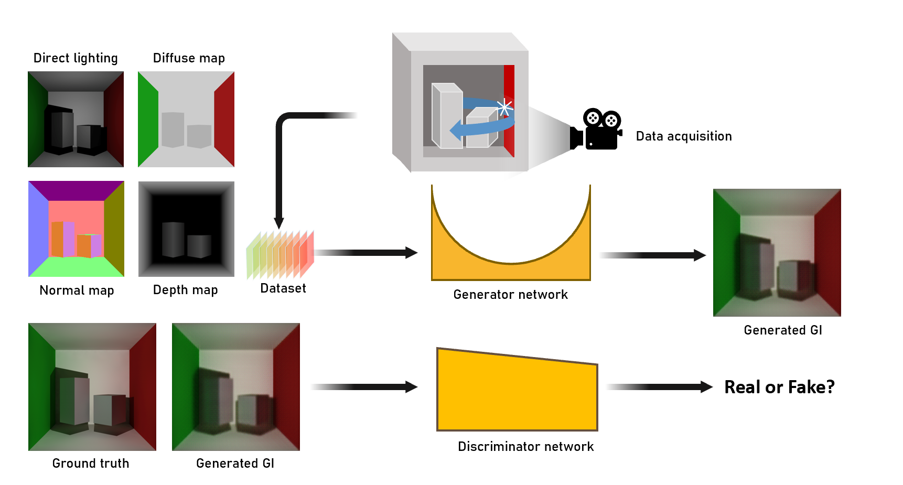

# SRDGI：Real-time Global Illumination via deep learning

This is the SRDGI project code for the cs337 course. This project proposes a method to further improve the performance of the network, balancing rendering quality with prediction time, to obtain a new network SRDGI, while regenerating a more diverse dataset, using which the SRDGI is trained with further enhanced generalization capabilities to meet a wider range of hardware and latency requirements.



# Dataset

##Download Datasets

The training images dataset we used can be downloaded from (https://jbox.sjtu.edu.cn/l/t1cKmu).

You will download two directory

- dataset : the datset which have been divided into train, validate and test dataset in different scenes
- output : the raw data we get by some rendering engine (Unity VXGI, C4D Octane) 

## Create your own dataset

We also provide a simple way to create your own dataset from the raw data in the output directory.

What you need to is follow 3 simple steps:

1. Build the local directory `output` and build a subdirectory named of yout own scene
2. Put your own G-buffer images (aledo,direct,depth,normal) and ground truth images into this subdirectory.
3. Choose one proper sricpt file in the directory `dataset_generator` to divide your images and verify the script of your own scene's name  
    Then execute the whole script below:(we use dataset_move_oc.py as a example)
   ```
   python dataset_move_oc.py
   ```

# Usage

## SRDGI

Train model

```
python train.py --dataset PATH_TO_DATASETDIR --n_epoch 50 --resume_G PATH_TO_RESUME_GENERATER --resume_D PATH_TO_RESUME_DISCRIMINATOR
```

- `--dataset`: path to dataset.
- `--n_epoch`: number of training epochs.
- `--resume_G`: path to generator checkpoints to resume.
- `--resume_D`: path to discriminator checkpoint to resume.

test model

```
python test_compare.py --dataset PATH_TO_DATASETDIR --model PATH_TO_MODEL
```

- `--dataset`: path to dataset.
- `--model`: path to model.

## Dynamic Channels

Before you train or test the dynamic channels model, you should prepare the dataset file directory first and be located in the directory `Dynamic-channels` 

```
cd Dynamic-channels/
```

Train model

```
python train.py --dataset PATH_TO_DATASETDIR --n_epoch 50 --dynamic_channels 1
```

- `--dataset`: path to dataset.
- `--n_epoch`: number of training epochs.
- `--dynamic_channels`: set it to 1 for running with dynamic channel, 0 for full channel.

Render image

```
python test.py --model PATH_TO_MODEL --dataset PATH_TO_DATASETDIR --accuracy 1
```

- `--model`: path to model.
- `--dataset`: path to dataset.
- `--accuracy`: an integer between 1 and 4, the larger the rendering accuracy the higher.
